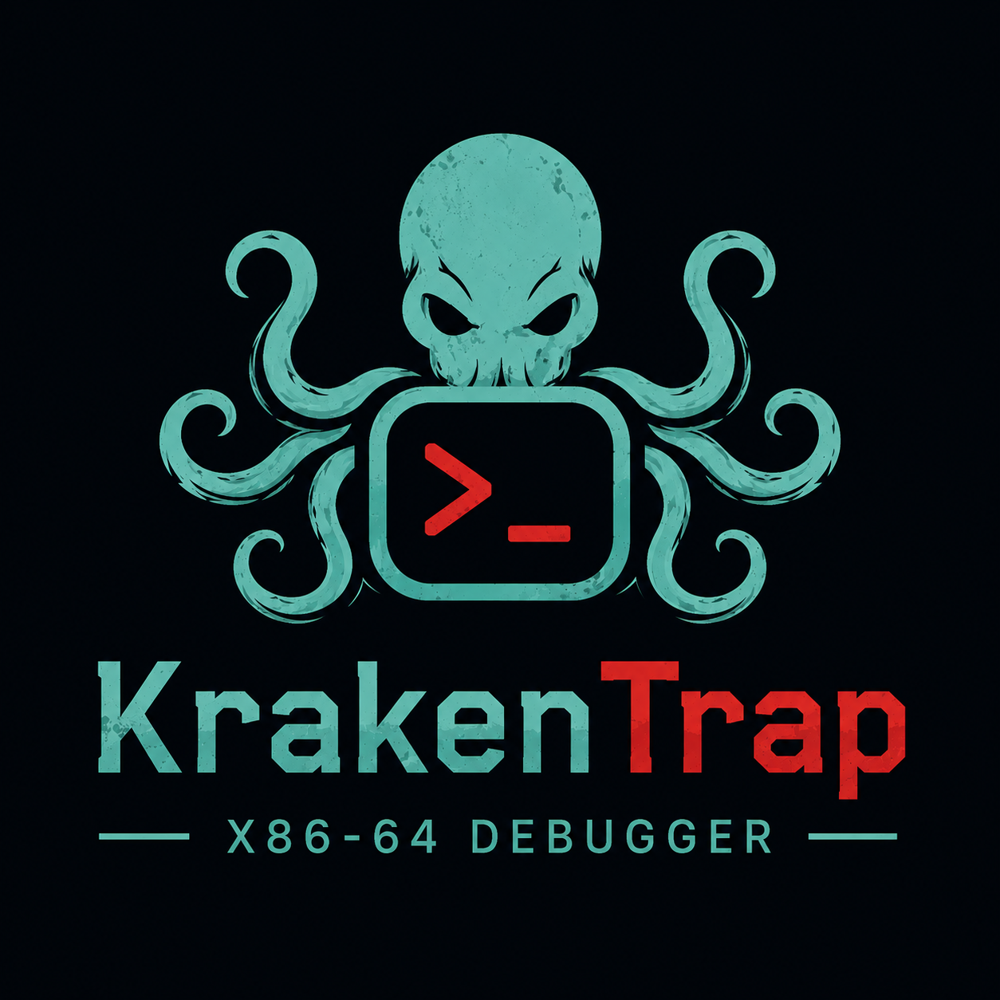

<p align="center">
  
</p>

# KrakenTrap

KrakenTrap is a Linux x86-64 debugger for authorized reverse engineering, lab debugging, and low-level systems learning.

The project is currently focused on building a small debugger core in C using `ptrace`. It is intended to grow into a reverse-engineering workflow component for IntentLimit, but the current priority is getting the native debugger foundation correct first.

## Current Features

KrakenTrap currently supports:

* Launching a target binary under `ptrace`
* Interactive `kt>` command prompt
* Reading and printing general-purpose registers
* Single-stepping instructions
* Continuing target execution
* Setting multiple software breakpoints with `int3`
* Restoring original instruction bytes after breakpoint hits
* Rewinding `RIP` after breakpoint traps
* Re-enabling persistent breakpoints after stepping over them
* Killing the traced child process cleanly on quit
* Modular C source layout

## Project Status

This is an early prototype.

The current build is useful for learning and experimenting with debugger internals, but it is not a replacement for GDB or LLDB. KrakenTrap is intentionally small and focused so each debugger feature can be built and understood directly.

## Requirements

* Linux
* x86-64
* GCC
* Make
* A target binary compiled for local debugging

## Build

```bash
make
```

## Build Example Target

```bash
make example
```

The example target is built with debugging-friendly flags:

```bash
-g -no-pie -fno-stack-protector
```

This makes addresses easier to inspect while KrakenTrap is still using raw address breakpoints.

## Run

```bash
./krakentrap ./examples/loop
```

You should see the `kt>` prompt:

```text
kt>
```

## Basic Usage

Find the address of `main` in the example binary:

```bash
nm examples/loop | grep " main"
```

Example output:

```text
0000000000401136 T main
```

Start KrakenTrap:

```bash
./krakentrap ./examples/loop
```

Set a breakpoint:

```text
kt> b 0x401136
```

Continue execution:

```text
kt> c
```

Print registers:

```text
kt> p
```

Single-step:

```text
kt> s
```

Quit:

```text
kt> q
```

## Commands

| Command    | Description                               |
| ---------- | ----------------------------------------- |
| `b <addr>` | Set a software breakpoint at an address   |
| `c`        | Continue target execution                 |
| `s`        | Single-step one instruction               |
| `p`        | Print general-purpose registers           |
| `h`        | Show help                                 |
| `q`        | Kill the traced child and exit KrakenTrap |

## Example Session

```text
$ ./krakentrap ./examples/loop
target started. running './examples/loop'
kt> b 0x401136
breakpoint set at 0x401136
kt> c
child stopped with signal 5
hit breakpoint at 0x401136
=-=-=-= Register Table =-=-=-=
RIP: 0x401137
RSP: 0x7ffd...
RBP: 0x7ffd...
RAX: 0x...
...
=-=-=-=-=-=-=-=-=-=-=-=-=-=-=-=
breakpoint restored to original instruction
kt> c
breakpoint re-enabled at 0x401136
loop: 0
loop: 1
loop: 2
loop: 3
loop: 4
child exited with code 0
```

## Current Limitations

KrakenTrap is still early and intentionally limited.

Current limitations:

* Linux x86-64 only
* Local target binaries only
* No attach-to-existing-process support yet
* Breakpoints require raw addresses
* No symbol resolution yet
* No memory examine command yet
* No disassembly yet
* No stack/context view yet
* No command history or session logging yet
* No automated tests yet

## Planned Features

Near-term planned work:

* Memory examine command
* Stack memory dump
* Breakpoint listing and deletion
* ELF header parsing
* Symbol lookup for commands like `b main`
* Disassembly around `RIP`
* Cleaner command parsing
* Session logging
* Test binaries and regression tests

Longer-term planned work:

* Capstone-backed disassembly
* Context view for registers, stack, and nearby instructions
* Markdown/JSON session reports
* Python API
* IntentLimit integration

## Repository Layout

```text
.
├── docs/                  Project notes, architecture, roadmap, and usage docs
├── examples/              Small target programs for debugger testing
├── include/krakentrap/    Public project headers
├── scripts/               Helper scripts
├── src/                   C source files
├── Makefile               Build configuration
└── README.md
```

Core source modules:

```text
src/main.c         Program entry point
src/process.c      Target launch and tracing setup
src/repl.c         Interactive debugger command loop
src/breakpoint.c   Software breakpoint logic
src/registers.c    Register read/write helpers
```

## Safety and Scope

KrakenTrap is built for authorized reverse engineering, local lab binaries, debugger development, and systems programming education.

Do not use this tool against systems, software, or processes you do not own or have explicit permission to analyze.

## Credits

The initial `ptrace` prototype was based on Eli Bendersky’s “How debuggers work: Part 1 - Basics.”

Original article:

```text
https://eli.thegreenplace.net/2011/01/23/how-debuggers-work-part-1
```

Original code samples:

```text
https://github.com/eliben/code-for-blog
```

Eli’s `code-for-blog` repository states that, unless otherwise noted, the code samples are public domain / Unlicense.

## License

See `LICENSE`.
